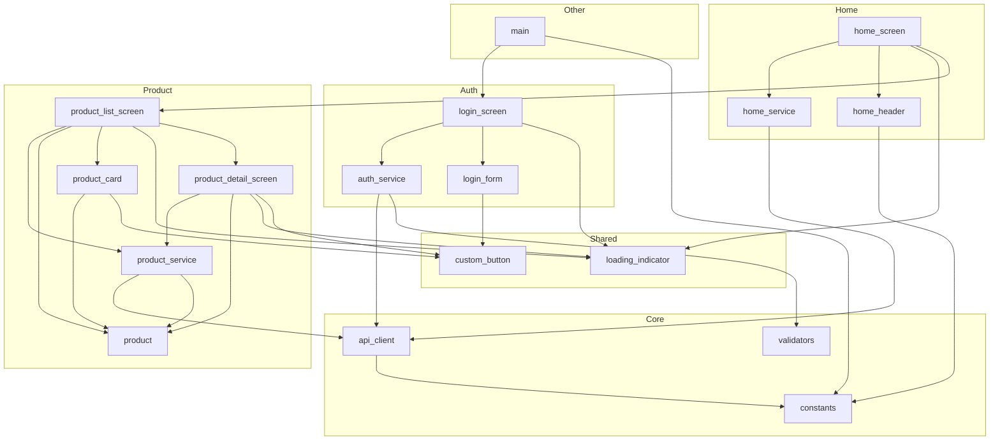

# Dependency Graph

```mermaid
flowchart TD
    subgraph "Auth"
        n3[login_screen]
        n4[auth_service]
        n5[login_form]
    end

    subgraph "Home"
        n6[home_screen]
        n7[home_service]
        n8[home_header]
    end

    subgraph "Product"
        n9[product]
        n10[product_detail_screen]
        n11[product_list_screen]
        n12[product_service]
        n13[product_card]
    end

    subgraph "Core"
        n0[api_client]
        n1[constants]
        n2[validators]
    end

    subgraph "Shared"
        n15[custom_button]
        n16[loading_indicator]
    end

    subgraph "Other"
        n14[main]
    end

    n0 --> n1
    n3 --> n4
    n3 --> n5
    n3 --> n16
    n4 --> n0
    n4 --> n2
    n5 --> n15
    n6 --> n7
    n6 --> n8
    n6 --> n16
    n6 --> n11
    n7 --> n0
    n8 --> n1
    n10 --> n12
    n10 --> n9
    n10 --> n16
    n10 --> n15
    n11 --> n12
    n11 --> n9
    n11 --> n13
    n11 --> n16
    n11 --> n10
    n12 --> n0
    n12 --> n9
    n13 --> n9
    n13 --> n15
    n14 --> n3
    n14 --> n1
```
